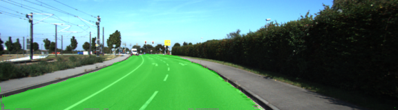

# 场景分割项目

## 介绍

在本项目将使用完全卷积网络（FCN）在图像中以像素标记道路。

<p align="center">
 
 <br>Qualitative results.
</p>

## Frameworks and Packages

Make sure you have the following is installed:

- [Python 3](https://www.python.org/)
- [TensorFlow](https://www.tensorflow.org/)
- [NumPy](http://www.numpy.org/)
- [SciPy](https://www.scipy.org/)

## Dataset

Download the [Kitti Road dataset](http://www.cvlibs.net/datasets/kitti/eval_road.php) from [here](http://www.cvlibs.net/download.php?file=data_road.zip).  Extract the dataset in the `data` folder.  This will create the folder `data_road` with all the training a test images.

## Run

Run the following command to run the project:

```
python main.py
```

**注**：如果在Jupyter笔记本系统中运行此功能，则终端中可能会出现与测试状态相关的消息。
