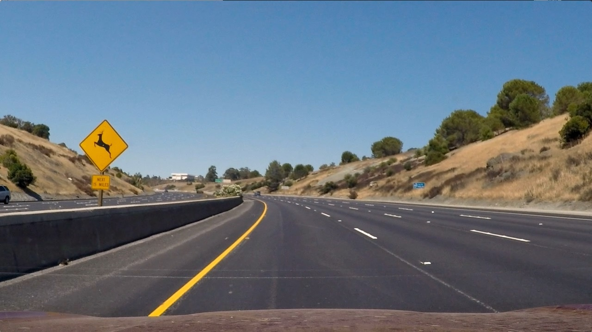
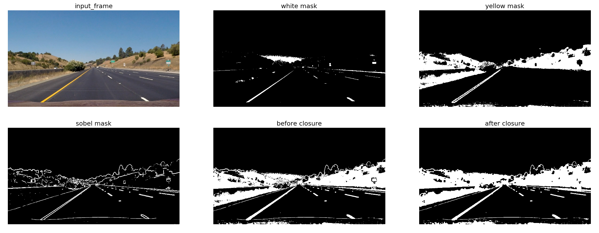

# Project 2 - Advanced Lane Finding


高级车道线检测项目的目标是应用计算机视觉高级技术检测车道线，整个项目的步骤如下：

* 计算相机校正矩阵参数。
* 应用校正算法处理源图片。
* 应用颜色变换、梯度等方法图片车道线分类阈值。
* 检测车道线像素和拟合车道线边界
* 确定车道曲率和车辆相对于中心的位置。
* 检测到的车道边界变换回原始图像。
* 输出车道边界的视觉显示以及车道曲率和车辆位置的数值估计。

### 1. 摄像头校准

OpenCV为相机校准任务提供了一些非常有用的内置函数。为了检测[calibration images]（./camera_-cal/）中的校准模式，我们可以使用函数`cv2.findChessboardCorners（image，pattern_-size）`。 

一旦我们存储了一组图像的3D世界和2D图像点之间的对应关系，我们就可以通过`cv2.calibleCamera（）`实际校准相机。除此之外，该函数还返回*相机矩阵*和*失真系数*，我们可以使用它们来消除帧的失真。

此步骤的代码在[calibration_utils](calibration_utils.py)中找到。
使用`cv2.undistort（）`函数对测试图像进行了失真校正，并获得了以下结果（在图像边界上更容易看到校准的效果）：

<table style="width:100%">
  <tr>
    <th>
      <p align="center">
           
           <br>Chessboard image before calibration
      </p>
    </th>
    <th>
      <p align="center">
           
           <br>Chessboard image after calibration
      </p>
    </th>
  </tr>
</table>

### 2. 应用校正算法处理源图片

一旦相机被校准，就可以使用相机矩阵和失真系数来消除测试图像的失真。事实上，如果研究道路的“几何结构”，必须确保我们正在处理的图像不会出现扭曲。以下是其中一幅测试图像的失真校正结果：

<table style="width:100%">
  <tr>
    <th>
      <p align="center">
           
           <br>Test image before calibration
      </p>
    </th>
    <th>
      <p align="center">
           
           <br>Test image after calibration
      </p>
    </th>
  </tr>
</table>

在这种情况下，不太容易看出差别，仔细观察图像最左侧和最右侧就能看到一些差异。

### 3. 使用颜色变换、梯度或其他方法创建阈值黑白图像

从输入帧正确创建二值图像是至关重要一步，这将引导我们检测车道。如果二值图像不好，则很难在管道的后续步骤中恢复并获得良好的结果。与此部分相关的代码可以在[此处](./binarization_utils.py)中找到。

这里使用颜色和梯度阈值的组合来生成二值图像。为了检测白线，[均衡直方图](http://docs.opencv.org/3.1.0/d5/daf/tutorial_py_histogram_equalization.html)阈值化前输入帧的效果非常好，可以高亮显示实际车道线。对于黄线，在[HSV](http://docs.opencv.org/3.2.0/df/d9d/tutorial_py_colorspaces.html)颜色空间中的V通道上使用了一个阈值。此外，还将输入帧与Sobel核进行卷积，以获得直线梯度的估计。最后，我使用[形态学闭包](http://docs.opencv.org/3.0-beta/doc/py_tutorials/py_imgproc/py_morphological_ops/py_morphological_ops.html)填补二进制图像中的空白。这里我展示了每个子步骤和最终输出：


<p align="center">
  
</p>

### 4. 透视变换

与两个透视图之间的扭曲相关的代码可以在[此处](./perspective_utils.py)找到。函数`calibration_utils.birdeye（）`将帧（颜色或二进制）作为输入，并返回场景的鸟瞰图。为了执行透视变换，需要在原始空间中映射4个点，在变换空间中映射4个点。

```
    h, w = img.shape[:2]

    src = np.float32([[w, h-10],    # br
                      [0, h-10],    # bl
                      [546, 460],   # tl
                      [732, 460]])  # tr
    dst = np.float32([[w, h],       # br
                      [0, h],       # bl
                      [0, 0],       # tl
                      [w, 0]])      # tr

```

通过将“src”和“dst”点绘制到测试图像及其变换的对应图像上，验证透视变换是否如预期的那样工作，以验证线条在变换的图像中是否平行。

<p align="center">
  
</p>

### 5. 识别车道线像素和拟合车道线

为了识别给定二值图像的哪些像素属于车道线，我们（至少）有两种可能性。如果我们有一个全新的框架，并且我们从未确定车道线在哪里，我们必须在框架上执行彻底的搜索。此搜索在`line_u utils.get_fits_by_Slideng_windows()`实现：从图像底部开始，精确地从二值图像直方图的峰值位置开始，向图像的上侧滑动两个窗口，确定哪些像素属于哪个车道线。 

另一方面，如果我们正在处理一个视频，并且我们自信地在前一帧中识别出了车道线，我们可以将搜索限制在我们之前检测到的车道线附近：毕竟我们是以30fps的速度进行的，所以这些线不会太远。第二种方法在`line_utils.get_fits_by_previous_fits（）`实现。为了跟踪连续帧中检测到的车道线，使用了`line_utils.line`中定义的类，这有助于保持代码的整洁。 


```
class Line:

    def __init__(self, buffer_len=10):

        # flag to mark if the line was detected the last iteration
        self.detected = False

        # polynomial coefficients fitted on the last iteration
        self.last_fit_pixel = None
        self.last_fit_meter = None

        # list of polynomial coefficients of the last N iterations
        self.recent_fits_pixel = collections.deque(maxlen=buffer_len)
        self.recent_fits_meter = collections.deque(maxlen=2 * buffer_len)

        self.radius_of_curvature = None

        # store all pixels coords (x, y) of line detected
        self.all_x = None
        self.all_y = None
    
    ... methods ...
```

实际的处理管道是在[main.py](./main.py)中的函数`process_pipeline()`中实现的。如图所示，当车道线检测可用于前一帧时，通过`line_utils.get_fits_by_previous_fits()`搜索新的车道线;否则，将执行更昂贵的滑动窗口搜索。 

本阶段的定性结果如下所示：


<table style="width:100%">
  <tr>
    <th>
      <p align="center">
           
           <br>Bird's-eye view (binary)
      </p>
    </th>
    <th>
      <p align="center">
           
           <br>Bird's-eye view (lane detected)
      </p>
    </th>
  </tr>
</table>

### 6. 计算车道曲率半径和车辆相对于中心的位置


从`compute_Offset_from_center()`中计算车道中心的偏移量，作为[main.py](./main.py)中定义的处理管道的步骤之一。从车道中心的偏移可以在摄像机固定并安装在车顶中点的假设下计算。在这种情况下，我们可以将车辆与车道中心的偏差近似为图像中心与检测到的两条车道线的图像底部中点之间的距离。 

在上一个车道线检测阶段，使用`np.polyfit()`对每条车道线拟合一个二阶多项式。此函数返回描述曲线的3个系数，即二阶和一阶项的系数加上偏差。根据这个系数，在[这个](http://www.intmath.com/applications-differentiation/8-radius-curvature.php)方程，我们可以计算曲线的曲率半径。从实现的角度来看，我决定将此方法作为`Line`类的属性移动。


```
class Line:
  ... other stuff before ...
    @property
    # average of polynomial coefficients of the last N iterations
    def average_fit(self):
        return np.mean(self.recent_fits_pixel, axis=0)

    @property
    # radius of curvature of the line (averaged)
    def curvature(self):
        y_eval = 0
        coeffs = self.average_fit
        return ((1 + (2 * coeffs[0] * y_eval + coeffs[1]) ** 2) ** 1.5) / np.absolute(2 * coeffs[0])

    @property
    # radius of curvature of the line (averaged)
    def curvature_meter(self):
        y_eval = 0
        coeffs = np.mean(self.recent_fits_meter, axis=0)
        return ((1 + (2 * coeffs[0] * y_eval + coeffs[1]) ** 2) ** 1.5) / np.absolute(2 * coeffs[0])
```

### 7. 可视化结果显示

整个处理流程从输入帧开始，包括校正失真、二值化、车道检测和变换回原始图像，在[main.py](./main.py)中的函数`process_pipeline()`中实现。

给定测试图像之一的定性结果如下：

<p align="center">
     
     <br>Qualitative result for test2.jpg
</p>


