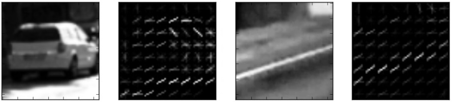
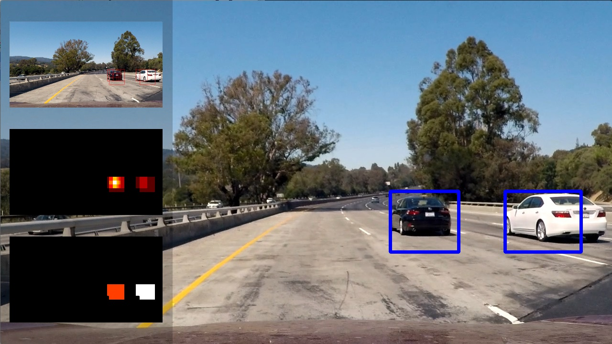
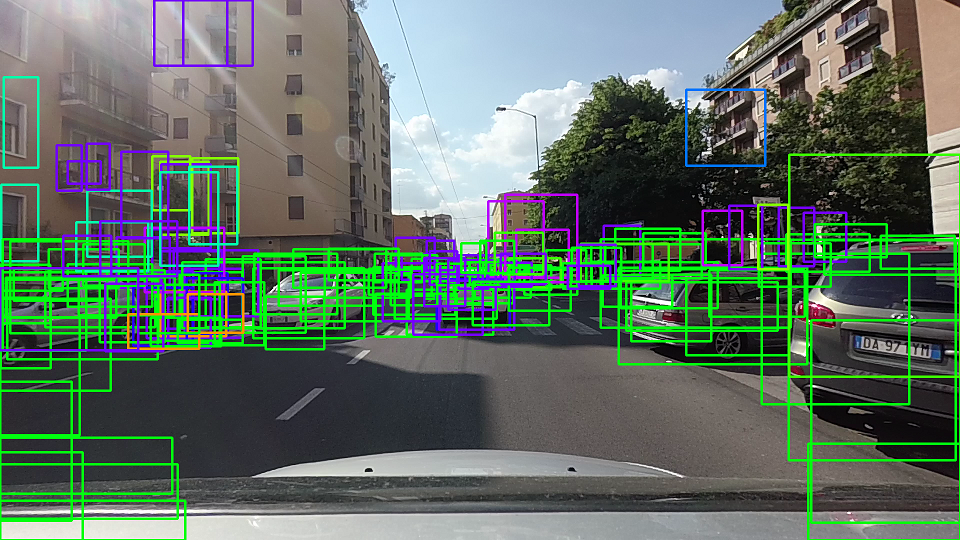
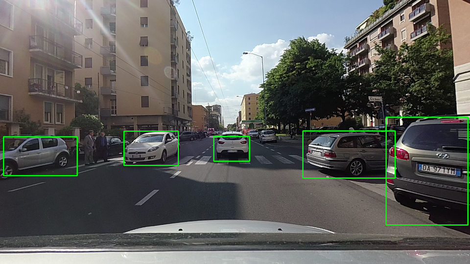

# Vehicle Detection Project

<p align="center">
 
</p>

## 1. 介绍

此项目的目标是开发一个基于单一前视摄像头可靠地动态检测汽车的算法模型，以传统计算机视觉方法“HOG特征+线性SVM检测车辆，时间平滑去除假阳性”作为对比基线，以深度学习算法[SSD深度网络](https://arxiv.org/pdf/1512.02325.pdf)作为主要模型进行检测。

## 2.传统CV：定向梯度直方图（HOG）

### 2.1 特征提取

在计算机视觉领域，“特征”是一种紧凑的表示形式，它对与给定任务相关的信息进行编码。在我们的例子中，特征必须具有足够的信息量，以尽可能准确地区分*汽车*和*非汽车*图像块。
以下是此数据集中“vehicle”和“non vehicle”类的外观示例：

<p align="center">
  
  <br>Randomly-samples non-car patches.
</p>

<p align="center">
  
  <br>Randomly-samples car patches.
</p>

与特征提取相关的大部分代码都包含在[functions_feat_extraction.py](./functions_feat_extraction.py)中。尽管如此，特征提取阶段使用的所有参数都作为字典存储在[config.py](config.py)中，以便能够从项目中的任何位置访问它们。
实际特征提取由函数`image_to_features`执行，该函数将图像和参数字典作为输入，并返回为该图像计算的特征。为了在整个数据集上执行批量特征提取（用于训练），“从文件中提取特征”将图像列表作为输入，并返回特征向量列表，每个输入图像一个。
对于汽车检测任务，可以使用*颜色直方图*和*空间特征*对物体的视觉外观进行编码，并使用弓形特征对物体的*形状*进行编码。虽然前两个特性很容易理解和实现，但HOG特性可能更难掌握。

### 2.2 选择HOG参数

HOG代表“梯度方向直方图”，指的是一个强大的描述符，自2005年[简介](http://vc.cs.nthu.edu.tw/home/paper/codfiles/hkchiu/201205170946/Histograms%20of%20Oriented%20Gradients%20for%20Human%20Detection.pdf)问世以来，它在计算机视觉以人的检测为主要目的的领域获得了广泛的成功。

<p align="center">
  
  <br>Representation of HOG descriptors for a car patch (left) and a non-car patch (right).
</p>

为了正常工作，HOG附带了很多参数需要调整。主要参数是累积梯度的单元大小，以及用于离散梯度直方图的方向数。此外，必须指定组成块的单元数量，稍后将对其执行特征规范化。最后，作为单通道图像上计算的HOG，需要决定使用哪个通道，最终计算所有通道上的特征，然后连接结果。

为了选择正确的参数，需要考虑分类器的精度和计算效率。在各种尝试之后，找到了存储在[config.py](config.py)中的以下参数：

```
# parameters used in the phase of feature extraction
feat_extraction_params = {'resize_h': 64,             # resize image height before feat extraction
                          'resize_w': 64,             # resize image height before feat extraction
                          'color_space': 'YCrCb',     # Can be RGB, HSV, LUV, HLS, YUV, YCrCb
                          'orient': 9,                # HOG orientations
                          'pix_per_cell': 8,          # HOG pixels per cell
                          'cell_per_block': 2,        # HOG cells per block
                          'hog_channel': "ALL",       # Can be 0, 1, 2, or "ALL"
                          'spatial_size': (32, 32),   # Spatial binning dimensions
                          'hist_bins': 16,            # Number of histogram bins
                          'spatial_feat': True,       # Spatial features on or off
                          'hist_feat': True,          # Histogram features on or off
                          'hog_feat': True}           # HOG features on or off
```

### 2.3 训练分类器

一旦决定使用哪些特征，就可以在这些特征上训练分类器。在[train.py](train.py)中，我训练了一个线性支持向量机，用于二元分类任务*car*与*non-car*。

首先，列出训练数据，并为每个图像提取特征向量：

```
    cars = get_file_list_recursively(root_data_vehicle)
    notcars = get_file_list_recursively(root_data_non_vehicle)

    car_features = extract_features_from_file_list(cars, feat_extraction_params)
    notcar_features = extract_features_from_file_list(notcars, feat_extraction_params)
```

然后，将实际训练集组成所有汽车和所有非汽车特征的集合（相应地给出标签）。此外，对特征向量进行了标准化，以使所有特征在相似的范围内，便于训练。

```
    feature_scaler = StandardScaler().fit(X)  # per-column scaler
    scaled_X = feature_scaler.transform(X)
```

开始训练LinearSVM分类器。

```
    svc = LinearSVC()  # svc = SVC(kernel='rbf')
    svc.fit(X_train, y_train)
```

为了了解分类器的性能，可以使用`svc.score（X_test，y_test）`对测试集进行预测。

### 2.4 滑动窗口搜索

在第一阶段中，先实现一种简单的滑动窗口方法，以便获得不同尺度的窗口，以便进行分类。这显示在[functions_detection.py](functions_detection.py)中的函数`compute_windows_multiscale`中。结果证明这是非常缓慢的。一些提升性能的方法可以是共同搜索感兴趣的区域，并对每个窗口进行分类。性能提升的原因是，对整个感兴趣区域只计算一次HOG特征，然后在不同的尺度下进行二次采样，以获得与多尺度搜索相同的效果，但计算效率更高。此函数在[functions_feat_extraction.py](functions_feat_extraction.py)中实现。当然，“折衷”是显而易见的：搜索规模越大，相邻窗口之间的重叠越多，从计算角度来看，搜索的性能就越差。

使用CV方法的整个分类管道在[main_hog.py](main_hog.py)中实现。每个测试图像都通过“处理管道”功能进行处理，该功能负责所有阶段：特征提取、分类和显示结果。

<p align="center">
  
  <br>Result of HOG pipeline on one of the test images.
</p>

为了优化分类器的性能，开始使用不同的参数配置进行训练，并保持最佳参数。在不同的尺度上执行检测也有很大帮助，即使在这个方向上进行检测会导致单个图像的计算时间非常长。在这个管道的末尾，整个处理过程，从图像读取到写入输出混合，每帧大约需要0.5秒。

## 3. 深度学习检测算法模型

### 1. SSD网络

为了解决上述问题，使用深度网络来执行检测，从而取代HOG+SVM管道。为此任务采用[SSD深度网络](https://arxiv.org/pdf/1512.02325.pdf)用于检测。SSD深度网络有几个优势：

- 该网络只需一步即可执行检测和分类(*fast*)
- 不再需要调整和验证与特征提取阶段相关的数百个参数（*稳健*）
- 作为非常常见的“car”类，各种预训练模型在不同的框架（Keras、Tensorflow等）中可用，这些框架已经能够很好地区分此类对象（*无需再训练*）
- 网络输出一个置信水平以及边界框的坐标，因此我们可以通过调整所需的置信水平（*少误报*）来决定折衷精度和召回率

## 4. 评价检测性能

在第一阶段，当我还在使用HOG+SVM时，我实现了一个热图来平均连续帧的检测结果。在标记区域之前，将热图阈值设置为最小值，以去除大部分假阳性。
当我转向深度学习时，正如前面提到的，我可以依靠“信心分数”来决定精确性和召回率之间的权衡。下图显示了在不同置信水平下阈值SSD检测的效果。

<table style="width:100%">
  <tr>
    <th>
      <p align="center">
           
           <br>SSD Network result setting minimum confidence = 0.01
      </p>
    </th>
    <th>
      <p align="center">
           
           <br>SSD Network result setting minimum confidence = 0.50
      </p>
    </th>
  </tr>
</table>

实际上，在使用SSD网络检测项目视频时，我发现随着时间的推移集成检测不仅没有用，甚至对性能有害。事实上，由于检测非常精确，假阳性率几乎为零，因此不再需要继续从以前的检测中获取信息。

在第一个阶段，HOG+SVM方法有点令人沮丧，因为它强烈依赖于选择的参数来执行特征提取、训练和检测。即使找到了一组或多或少适用于项目视频的参数，我也对结果不满意，因为项目视频中的参数调整得非常精细，对于不同的情况肯定不可靠。

出于这个原因，转向深入学习，并利用现有的检测网络（对Pascal VOC类进行了预培训）来解决这个问题。事实证明深度学习对于计算机视觉的问题基本都处理得很好。
